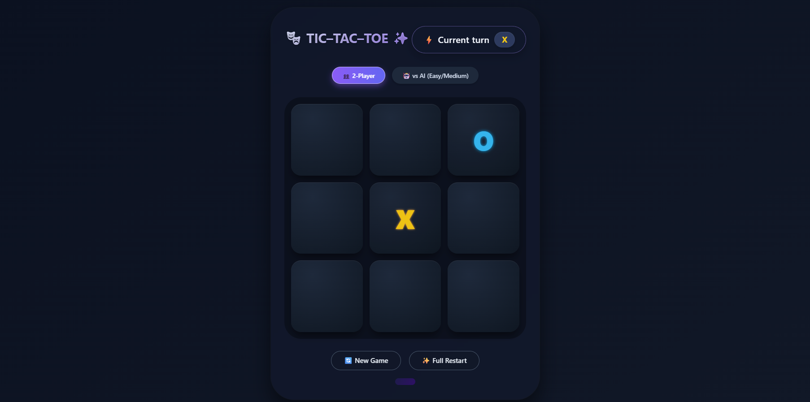
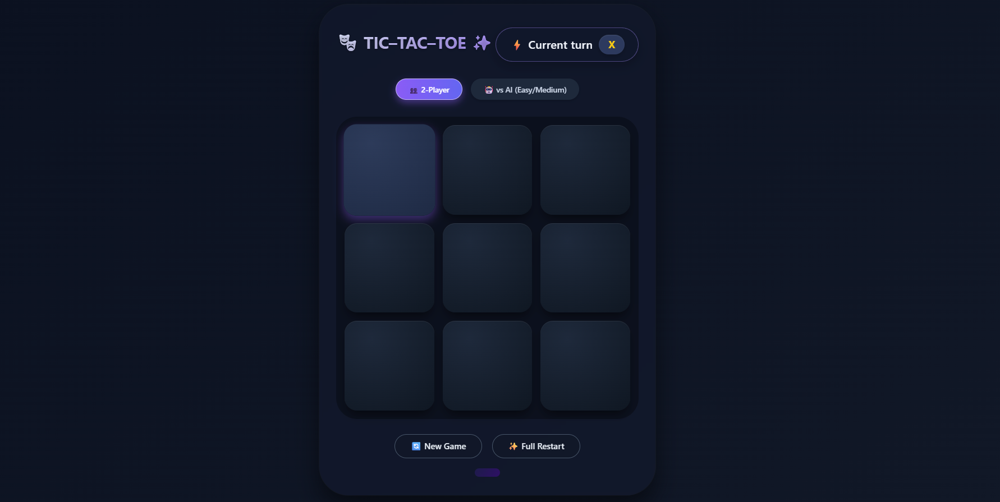
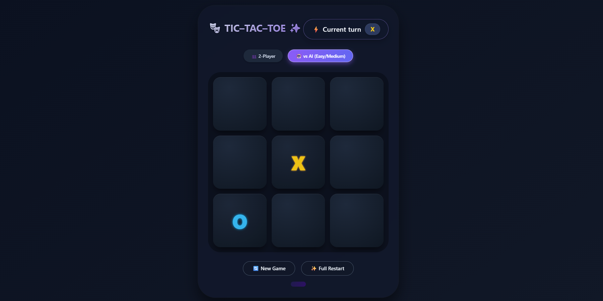
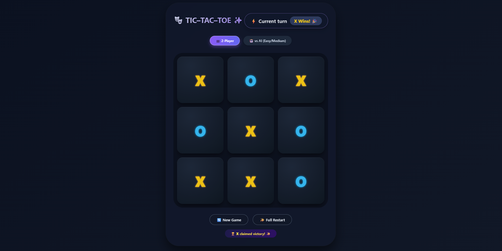
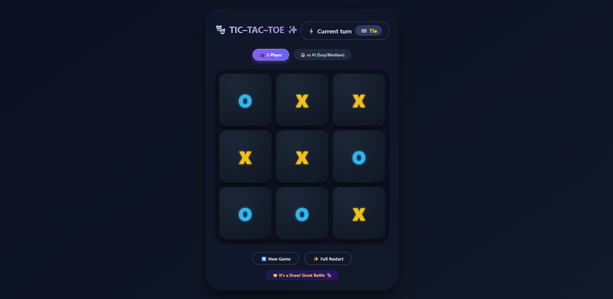
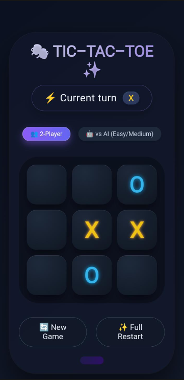
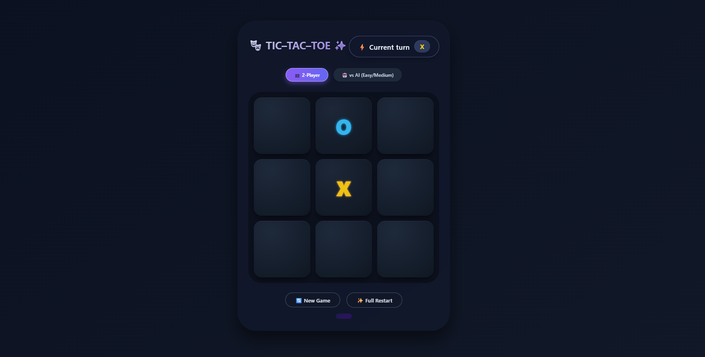

# 🎮 Tic-Tac-Toe: Arcane Duel | Prodigy Infotech Task-03

> **Task-03 Completion for Prodigy Infotech** — A beautifully animated, dual-mode Tic-Tac-Toe game with glass-morphic UI, smooth pop animations, and an intelligent AI opponent. Play against friends or challenge the computer.

---

## 🌐 Live Demo

> 🚀 **Play the game live here:** [https://yourusername.github.io/tic-tac-toe-prodigy-task03](https://yourusername.github.io/tic-tac-toe-prodigy-task03)

*(Replace the above link with your actual GitHub Pages URL after deployment)*

---

## 📋 Project Context

This project was developed as **Task-03** for my internship at **Prodigy Infotech**. The requirement was to build an interactive tic-tac-toe web application using HTML, CSS, and JavaScript with functions to handle user clicks, track game state, check winning conditions, and provide an engaging user experience.

---

## 🎯 Task Requirements Met

| Requirement | Status |
|-------------|--------|
| Handle user clicks on game cells | ✅ Complete |
| Track complete game state (board, turns, winner) | ✅ Complete |
| Check winning conditions (rows, columns, diagonals) | ✅ Complete |
| Support two-player mode | ✅ Complete |
| Support AI opponent mode | ✅ Complete |
| Interactive and engaging UI with animations | ✅ Complete |
| Responsive design for all devices | ✅ Complete |

---

## 📸 Screenshots Gallery

### 1. `gameplay.png` - Main Game Interface
*Mid-game action showing both X and O marks on the board*

---

### 2. `two-player-mode.png` - Two-Player Mode Active
*2-Player mode button highlighted with turn indicator showing X's turn*

---

### 3. `ai-mode.png` - VS AI Mode Active
*AI mode button highlighted with computer opponent making a move*

---

### 4. `win-screen.png` - Victory Celebration Screen
*Winning message display with winner badge and celebration effect*

---

### 5. `draw-screen.png` - Draw / Tie Game Screen
*Full board filled with no winner, showing tie message*

---

### 6. `mobile-view.png` - Mobile Responsive Design
*Game perfectly adapted for mobile devices with touch-friendly interface*

---

### 7. `animation-pop.png` - Smooth Pop Animation
*Visual effect when placing X or O marks on the board*

---

## 🎮 Features

### ✅ Two Game Modes

| Mode | Description |
|------|-------------|
| 👥 **2-Player Mode** | Play locally with a friend on the same device |
| 🤖 **vs AI Mode** | Challenge an intelligent computer opponent |

### 🎨 Modern UI/UX

- Glass-morphic design with blur effects
- Smooth pop-in animations for moves
- Gradient text and glowing effects
- Responsive layout (works on mobile & desktop)
- Hover effects and interactive feedback

### 🧠 AI Logic (Intermediate Level)

| Priority | Strategy |
|----------|----------|
| 1st | **Win** — If AI has a winning move, take it |
| 2nd | **Block** — If player is about to win, block that cell |
| 3rd | **Center** — Take the center cell (position 4) |
| 4th | **Corner** — Take any available corner (0, 2, 6, 8) |
| 5th | **Edge** — Take any remaining edge cell |

### 🔄 Game Management

- Real-time turn indicator with color coding
- Win/Draw detection with message display
- Reset Game button for quick restart
- Full Restart button for complete reset
- Dynamic board highlighting

---

## 🛠️ Technologies Used

| Technology | Purpose |
|------------|---------|
| **HTML5** | Game structure and semantic markup |
| **CSS3** | Animations, gradients, glass-morphism, responsive design |
| **JavaScript (ES6)** | Game logic, AI algorithm, state management |

---

## 👨‍💻 Author
**Chaithanya** - Web Development Intern  
PRODIGY INFOTECH
